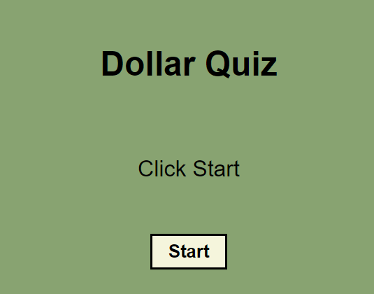

# JS-Dollar-Quiz

## Description

This webpage challenges the user to know historical figures on commonly used dollar bills.

## Usage

After hitting the start button, the quiz will start.
The user has 30 seconds to finish the quiz, with every wrong answer taking away five seconds.
At the end, you can view your result and score it.

## Webpage

Deployed Application: 
